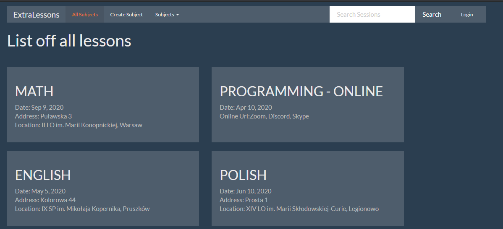
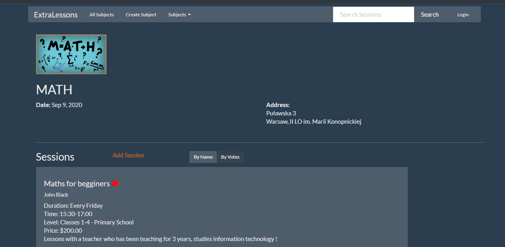
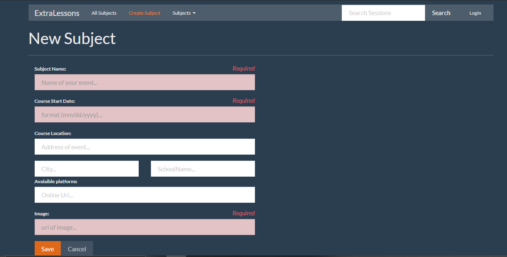
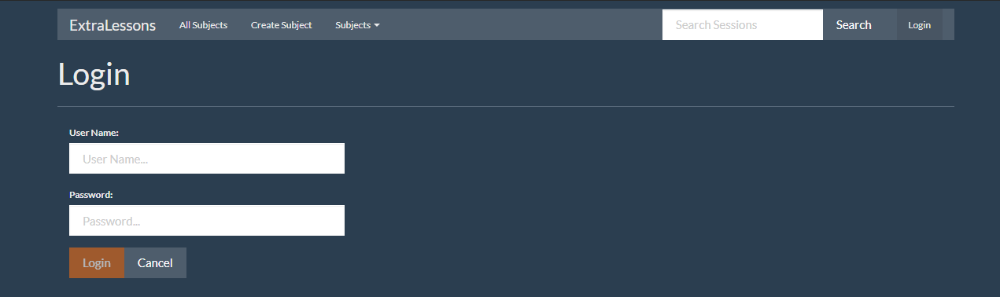
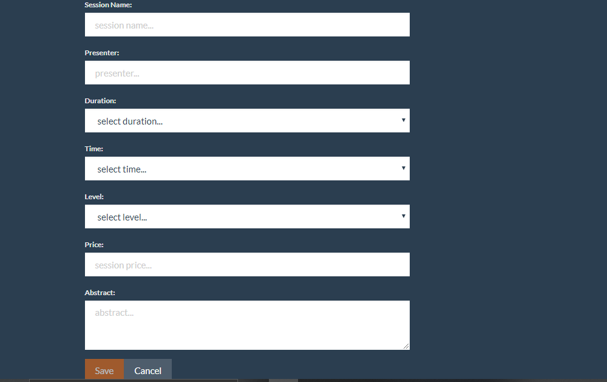

# EventMaster

This project I made for myself. It simulates us virtual school. You can choose one subject and choosewith one off session you want to pick. There you have few levels for learning. So you just need to sign up for a course which you wanna and voi'la!
App was writen using Angular 9. In Future I want to connect it with my API using Entity Framework and MVC model.
## Content
1. [ Description. ](#tech)
2. [ Usage tips. ](#open)
3. [ Screenshoots. ](#ss)
4. [ Main Features. ](#main)

## 1. Technologies:

* Angular 9
* JavaScript
* TypeScript
* HTML5
* CSS3

## 2. How to open a project?

* First thing you need to do is downolad Angular Cli and newest version of node.js from https://nodejs.org/en/.
* Next install npm server
* Last thing go into catalog with app and use ng serve --open

## 3. Screenshoots

First look at app

Details about one subject

Adding a new subject. This app has little security :).

You can login into this.

And also you can add a new session.

## 4. Main Features
* Capabilities to sign into a lessons
* Adding a new subject 
* Adding a new session
* Ability to login like admin or like normal user
## Status
Project in progress

## Contact

Dawid Baron || dawidbaron4@gmail.com
[linkedin ](https://www.linkedin.com/in/dawid-baron-925a67183/)
[github ](https://github.com/dawidbaron)

